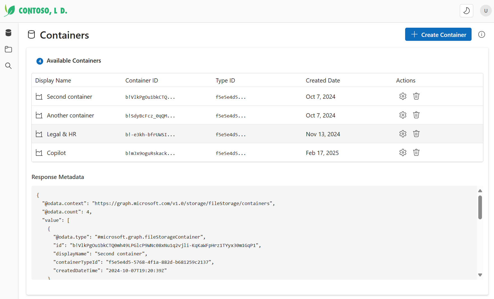
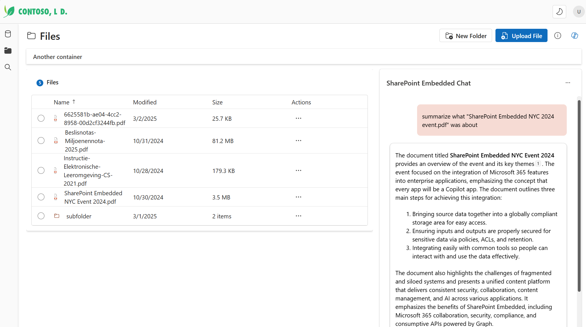

# Contoso SharePoint Embedded Application

A modern React application that demonstrates SharePoint Embedded (SPE) integration with a Fluent UI interface. This application allows users to manage containers, browse files, search content, and interact with AI-powered features like Copilot.

Note: This application is mostly build using GenAI tooling (VSCode Copilot Agent with Claude 3.7 Sonnet)

## Screenshots

### Container Management



### File Browser



### Search Functionality


## Features

- 📁 **Container Management**: Create, browse, and configure containers with custom properties
- 🗂️ **File Browser**: Upload, download, preview, and manage files within containers
- 🔍 **Global Search**: Search across all containers with filters and aggregations
- 🤖 **AI Copilot Integration**: Chat with your data using the SharePoint Embedded Copilot
- 🧩 **Custom Properties**: Add and manage metadata on containers
- 🗑️ **Recycle Bin Management**: View and restore deleted items
- 🎨 **Theme Support**: Light and dark mode with Fluent UI components

## Architecture

This application is built using:

- **React** - Frontend library
- **TypeScript** - Typed JavaScript
- **Fluent UI** - Microsoft's design system components
- **MSAL** - Microsoft Authentication Library for Azure AD
- **Vite** - Build tool and development server
- **SharePoint Embedded SDK** - For interacting with SharePoint Embedded storage

The codebase follows clean architecture principles with:

- **Models** - Data structures representing SPE entities
- **Services** - API interaction with SharePoint Embedded
- **Hooks** - React hooks for business logic
- **Components** - Reusable UI components
- **Utils** - Helper functions and utilities

## Prerequisites

- Node.js 16.x or higher
- npm or yarn
- Microsoft 365 developer account
- SharePoint Embedded setup with container type and proper permissions

## Getting Started

### 1. Clone the Repository

```bash
git clone https://github.com/your-org/contoso-spe-blazor.git
cd contoso-spe-blazor/contoso-spe
```

### 2. Install Dependencies

```bash
npm install
# or
yarn
```

### 3. Configure Environment Variables

Create a `.env` file in the root of the project based on the `.env.sample`:

```env
VITE_BACKEND_URL=https://your-backend-url
VITE_BACKEND_SCOPE='https://graph.microsoft.com/.default'
VITE_PUBLIC_APP_ID=your-app-id
VITE_PUBLIC_AUTHORITY_URL=https://login.microsoftonline.com/your-tenant-id
VITE_SPE_CONTAINER_TYPE_ID="your-container-type-id"
VITE_REACT_APP_SPO_HOST='https://your-tenant.sharepoint.com/'
```

### 4. Run Development Server

```bash
npm run dev
# or
yarn dev
```

This will start the development server at http://localhost:5173 (or the next available port).

### 5. Build for Production

```bash
npm run build
# or
yarn build
```

The build output will be in the `dist` directory.

## Key Components

- **Layout.tsx** - Main application layout with navigation
- **ContainerBrowser.tsx** - Displays and manages containers
- **FileBrowser.tsx** - File explorer with grid view and details panel
- **SearchResultsPage.tsx** - Global search results with filtering
- **CopilotChat.tsx** - AI assistant for interacting with your data

## Authentication

This app uses Microsoft Authentication Library (MSAL) for authentication with Azure Active Directory. The authentication flow is set up in `main.tsx` and requires proper app registration in the Azure portal.

## License

[MIT License](LICENSE)

## Additional Resources

- [SharePoint Embedded Documentation](https://docs.microsoft.com/en-us/sharepoint/dev/embedded/)
- [Fluent UI React Components](https://react.fluentui.dev/)
- [Microsoft Graph API](https://docs.microsoft.com/en-us/graph/)
- [React Documentation](https://reactjs.org/docs/getting-started.html)